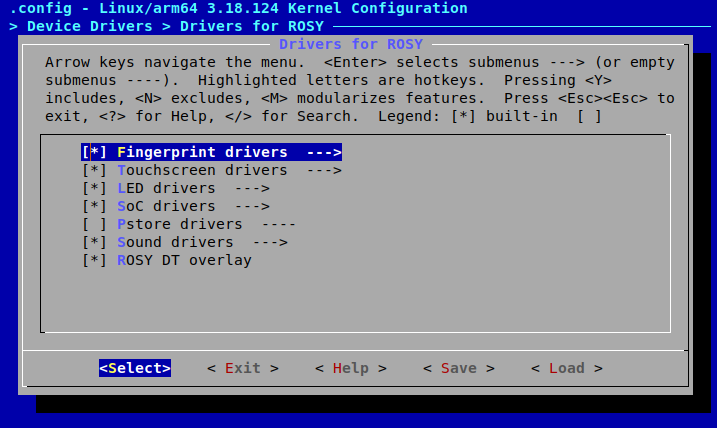

# Clean 3.18 CAF kernel for Xiaomi Redmi 5

Completely clean and minimal kernel base (bare-metal kernel). Use only with device trees that contain blobs specifically for rosy because you may experience problems with the device's core functions on heavily modified trees, e.g. the camera may not work.

##### Compatible trees:

Device tree: [1](https://github.com/NullDecoder/android_device_xiaomi_rosy.git) [2](https://github.com/baunilla/android_device_xiaomi_rosy.git)\
Vendor tree: [1](https://github.com/NullDecoder/android_vendor_xiaomi_rosy.git) [2](https://github.com/baunilla/android_vendor_xiaomi_rosy.git)\
Recovery tree: [1](https://github.com/NullDecoder/android_recovery_xiaomi_rosy.git)

Thanks to [@LinuxPanda](https://github.com/LinuxPanda) and [@baunilla](https://github.com/baunilla) for the trees!

## About phone


##### Basic specifications:
```
Codename - rosy
SoC - Snapdragon 450
CPU - Octa-core 1.8 GHz Cortex-A53
GPU - 600 MHz Adreno 506
```

Full specifications - [GSM Arena](https://www.gsmarena.com/xiaomi_redmi_5-8768.php)

## Features & information

##### Main features:
```
* Clean and minimal imports of code for ROSY.
* Can be compiled with GCC 8.3.0, all code warnings are fixed.
* Updated prima (Wi-Fi) drivers from CAF, compatible with GCC 8.3.0.
* Compiler optimizations.
* F2FS support.
```

##### Information:
```
- CPU governors: [interactive], conservative, ondemand, userspace, powersave, performance.
- I/O schedulers: [cfq], noop, deadline.
- TCP algorithms: [westwood], cubic, reno.
- Compression algorithms: [lz4], lzo.
```

## Branches

##### q-3.18-base:
```
Information:

- CAF tag LA.UM.8.6.r1-02900-89xx.0 (December 13, 2019; Linux 3.18.124; not upstreamed).
- For Android 10 (Q).
```

##### q-3.18-upstream:
```
Information:

This branch is clone of q-3.18-base with Google's common/android-3.18 merged (upstream).
```

## Cloning & building

This kernel contains submodules. To build it successfully, you have to either clone it with `--recursive` option or do `git submodule update --init --recursive` in the kernel directory after cloning.

Make sure you are building the kernel with `rosy-perf_defconfig`. In case you want to base on other defconfig, you can easily enable ROSY's drivers in any config using the kernel's `menuconfig`. You can find special section with drivers for ROSY in `menuconfig > Device Drivers > Drivers for ROSY`. Do not forget to build the Wi-Fi drivers though, they are in `menuconfig > Device Drivers > Staging drivers`.

##### Steps:
```
1 - make ARCH=arm64 <defconfig>
2 - make ARCH=arm64 menuconfig
3 - make ARCH=arm64 savedefconfig
4 - mv defconfig arch/arm64/configs/menuconfig_defconfig
```


